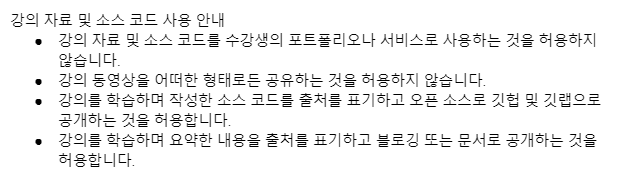

# 스프링과 JPA 기반 웹 애플리케이션 개발 강의 실습

## ✨ 강의 링크

- [인프런 - 스프링과 JPA 기반 웹 애플리케이션 개발](https://www.inflearn.com/course/%EC%8A%A4%ED%94%84%EB%A7%81-JPA-%EC%9B%B9%EC%95%B1/dashboard)

⚠ 해당 강의는 '스프링과 JPA 기반 웹 애플리케이션 개발' 강의를 수강 후 실습한 내용임을 알려드립니다. 

## 🛠 Dev-Stack

- IntelliJ IDEA (Ultimate) 2022.02.03
  - Spring Boot DevTools
  - Lombok
  - Spring Configuration Processor
  - Spring Web
  - Thymeleaf
  - Spring Security
  - Spring Data JPA
  - H2 Database
  - PostgreSQL Driver